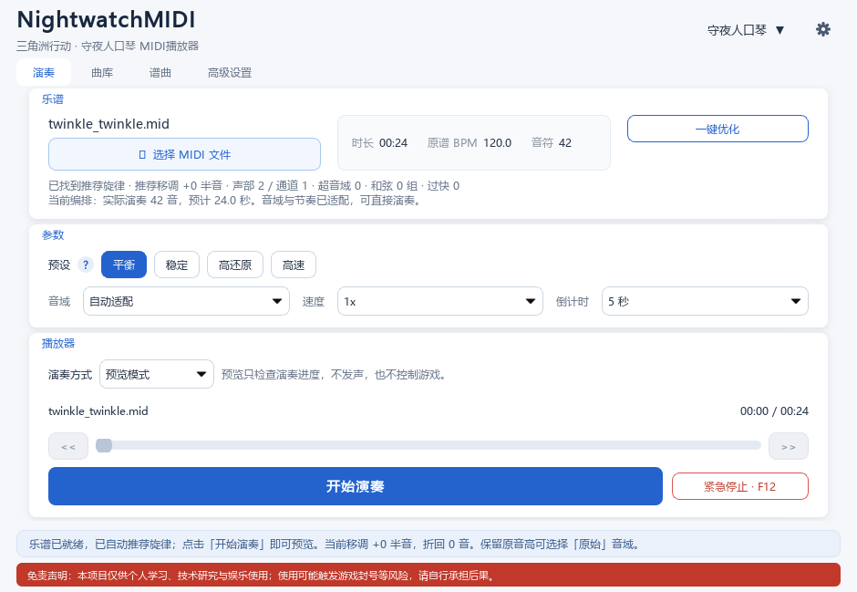

# NightwatchMIDI

三角洲行动 · 守夜人口琴 MIDI 播放器。支持 MIDI 文件、曲库、按键谱与简谱，通过标准 Windows SendInput 演奏。



> ## 免责声明
>
> **本项目采用 MIT 许可证，允许使用、修改与商业使用，请保留版权和许可声明。**
>
> 本软件通过模拟键盘与鼠标输入在游戏内演奏，可能违反游戏的用户协议；使用存在账号被警告、限制、回退或**封禁**的风险，也可能因误操作、系统延迟或兼容性问题导致异常，使用者需自行承担全部后果。请在使用前确认游戏规则与当地法律法规，继续使用即表示已理解并接受本声明。
>
> 启动软件时会先弹出完整声明，需选择「我已知晓，继续使用」或「退出」；主界面底部另常驻红色提示条，点击可再次查看。

## 直接使用（推荐玩家）

在 Releases 下载并解压 `NightwatchMIDI-Windows.zip`（包含《勾指起誓》《卡农》《小星星》），打开其中的 `NightwatchMIDI.exe`，双击打开即可：单文件、无需安装 Python、无控制台窗口。要求 Windows 10/11 64 位；首次运行会先显示免责声明。未签名的个人项目可能被 SmartScreen 拦截，选择“更多信息 → 仍要运行”即可。

## 快速开始（源码版）

适用于 Windows 10/11，使用 **Python 3.11**。下载并解压项目，在项目目录打开 PowerShell：

```powershell
py -3.11 -m venv .venv
.\.venv\Scripts\python.exe -m pip install .
```

然后双击 `start.cmd`，或执行：

```powershell
.\.venv\Scripts\python.exe -m nightwatch_midi
```

`start.cmd` 用无控制台的 `pythonw.exe` 启动，不会出现黑色命令行窗口；需要查看日志排查问题时请双击 `start-debug.cmd`，或在终端直接运行上面的命令。

如果 `py` 命令不可用，请用已安装的 Python 3.11 的完整路径代替。游戏以管理员权限运行时，可右键 `start.cmd`，选择“以管理员身份运行”；软件不会自行提权。

## 开始演奏

1. 点击“选择 MIDI 文件”，首次可选择 `examples/小星星.mid`。
2. 选择演奏预设，按需“一键优化”，确认音域、速度与倒计时。
3. 选择“游戏演奏模式”，点击“开始演奏”，在倒计时内切回游戏乐器页面。
4. 按 **F12** 紧急停止。结束或停止后自动回到预览模式。

默认预览模式不发声、不控制游戏。切换离开目标窗口会停止播放。当前不支持暂停；旋律取舍、移调和折回会改变原谱，不能保证复杂钢琴曲完整还原。

## 功能

- MIDI 旋律推荐、音域适配、速度与兼容性预设。
- 曲库搜索、收藏、最近播放和优化记录。
- 按键谱、简谱转 MIDI，保存到曲库。
- 播放起点与跳转；F8 重播、F9/F10 前后跳转、F12 停止。
- JSON 乐器配置；输入测试与诊断位于设置窗口。

曲库保存在 `%APPDATA%\NightwatchMIDI\library`；可用 `NIGHTWATCH_MIDI_HOME` 指定数据根目录。

## 项目导航

| 目录 | 内容 |
| --- | --- |
| `src/nightwatch_midi/` | 应用源码及乐器配置 |
| `tests/` | 仅使用模拟输入的自动测试 |
| `examples/` | 三首随包 MIDI 乐谱 |
| `docs/` | 使用说明、开发说明和截图 |
| `tools/` | 示例生成、离线分析、截图和源码打包工具 |

[详细使用说明](docs/usage.md) · [开发、测试与发布](docs/development.md) · [示例说明](examples/README.md)

## 实现与许可

Python 3.11、PySide6、mido；输入通过 ctypes 调用 Win32 SendInput。不进行 DLL 注入、游戏内存读写、驱动安装或反作弊绕过。

源码采用 [MIT License](LICENSE)。第三方依赖和用户导入歌曲遵循各自许可。
